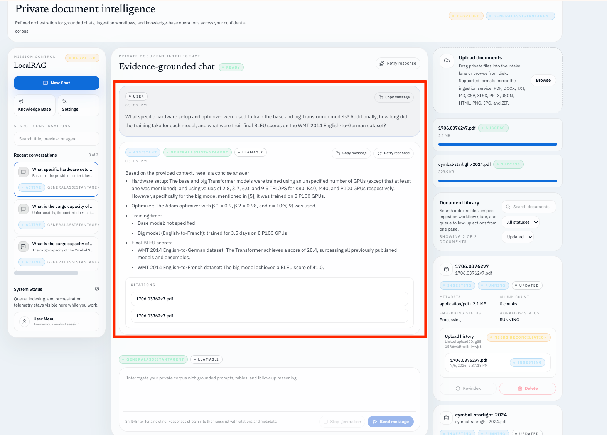
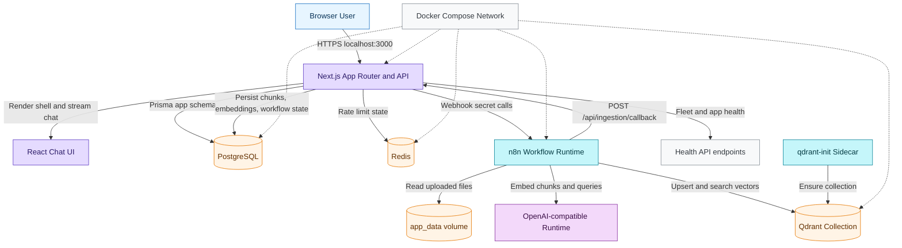
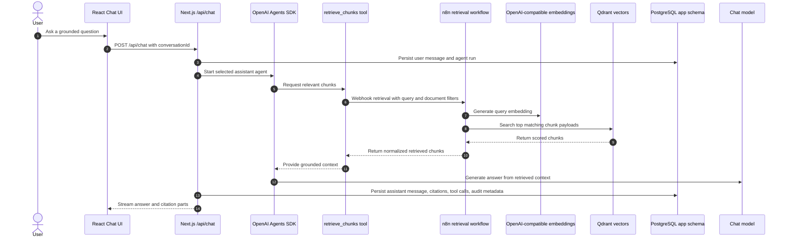
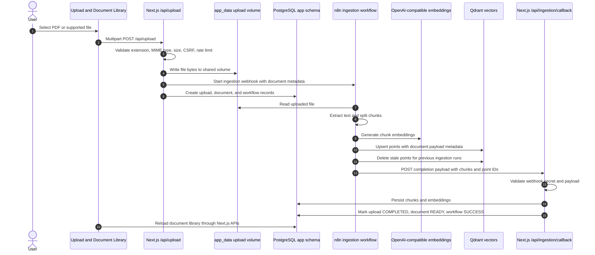
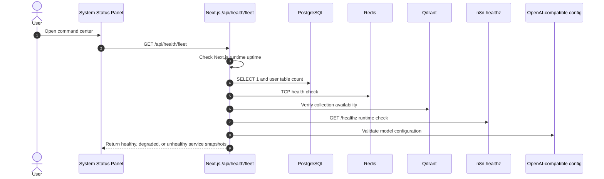

# localRAG-nextJS

Production-grade enterprise RAG foundation built with Next.js 15, React 19, OpenAI Agents SDK, Vercel AI SDK UI, Prisma, PostgreSQL, Redis, n8n, and Qdrant.



## Executive Summary & Business Impact

This repository delivers a private document-intelligence foundation that keeps the browser talking only to Next.js while Next.js brokers retrieval, ingestion, persistence, and workflow orchestration. Teams can run the stack locally, upload the two bundled PDFs through the real ingestion path, ask grounded questions in a ChatGPT-style UI, and inspect health, upload, and workflow state without exposing n8n, OpenAI-compatible runtime secrets, or database credentials to the client.

Business-wise, the app proves the core enterprise RAG loop end to end: confidential uploads, indexed corpus management, streaming answers with citations, and operational controls for health, workflow state, and auditability. It is intentionally a complete vertical slice rather than a partial demo, giving product and engineering stakeholders a deployable baseline for future document AI features.

## Tech Stack

- **Framework:** Next.js 15 App Router, React 19, TypeScript
- **AI orchestration:** `@openai/agents`, `@openai/agents-extensions`, AI SDK UI
- **Data layer:** Prisma, PostgreSQL, Redis-backed rate limiting
- **Retrieval pipeline:** n8n workflows, Qdrant
- **UI:** Tailwind CSS, Radix UI primitives, TanStack Query, React Hook Form, Zod
- **Observability & security:** Pino, request IDs, CSP middleware, CSRF checks, rate limiting, audit logs
- **Testing:** Vitest, Testing Library, Playwright
- **Delivery:** pnpm, Docker, Docker Compose

### Docker Services

The local Compose project runs the following services:

| Service       | Image / build                                       | Published port        | Role                                                                                                                                                                                                       |
| ------------- | --------------------------------------------------- | --------------------- | ---------------------------------------------------------------------------------------------------------------------------------------------------------------------------------------------------------- |
| `nextjs`      | Local `Dockerfile` build (`localrag-nextjs-nextjs`) | `3000:3000`           | Next.js development server, API routes, Prisma migrations on startup, chat UI, upload handling, ingestion callback persistence, and fleet health endpoint.                                                 |
| `postgres`    | `postgres:16.8-alpine`                              | `5432:5432`           | Shared PostgreSQL instance. Prisma uses the `app` schema for application data; n8n stores its workflow tables separately in the same database.                                                             |
| `qdrant`      | `qdrant/qdrant:v1.13.6`                             | Internal only         | Vector database for document chunks and retrieval payloads.                                                                                                                                                |
| `qdrant-init` | `node:22.18.0-alpine`                               | Internal only         | Bootstrap sidecar that ensures the configured Qdrant collection exists and stays healthy so dependent services can wait on it.                                                                             |
| `redis`       | `redis:7.4.5-alpine`                                | Internal only         | Redis runtime for rate-limiting state and fleet health checks.                                                                                                                                             |
| `n8n`         | `n8nio/n8n:1.103.2`                                 | `127.0.0.1:5678:5678` | Internal workflow runner for ingestion and retrieval; imports/activates committed workflows, calls OpenAI-compatible embedding APIs, writes Qdrant points, and posts ingestion completion back to Next.js. |

## Architecture

At runtime the browser communicates only with Next.js routes under `app/api/*`. Those routes validate requests, resolve the anonymous signed-cookie user, apply authorization and rate limits, persist application state in PostgreSQL through Prisma repositories/services, and stream agent responses back through AI SDK UI.

For ingestion and retrieval, Next.js calls the typed service layer in `lib/n8n/*`, which uses internal-only Docker networking and webhook-secret validation to reach the committed n8n workflows. Ingestion completion flows back through `POST /api/ingestion/callback`, where Next.js validates the same webhook secret, persists chunks/embedding metadata, and marks uploads, documents, and workflow executions complete. `X-N8N-API-KEY` is used only for optional n8n REST API operations such as workflow listing/polling when an administrator provisions a key. Qdrant stores vector payloads; PostgreSQL remains the system of record for conversations, messages, documents, chunks, embeddings, uploads, workflow executions, agent runs, tool calls, audit logs, and settings.



Key product surfaces in this slice:

- ChatGPT-style shell with sidebar, chat workspace, knowledge base, settings, and system status
- Streaming chat backed by `GeneralAssistantAgent`, `DocumentAgent`, and `RetrievalAgent`
- Upload, indexing, reindex, search, and workflow-status visibility for the knowledge base
- Health reporting for app, database, Redis, n8n, Qdrant, Qdrant bootstrap, and OpenAI-compatible runtime configuration

## Call flows

These diagrams show the main runtime paths through the local RAG stack. The browser always calls Next.js first; n8n, Qdrant, PostgreSQL, Redis, and OpenAI-compatible runtimes remain behind server-to-server boundaries.

### Chat and grounded retrieval



### Upload, ingestion, and completion callback



### Docker fleet health



## Local Development

1. Install dependencies:

   ```bash
   pnpm install
   ```

2. Create a Compose environment file and provide secrets:

   ```bash
   cp .env.example .env
   mkdir -p .local/uploads
   ```

   If you also run the app on the host, mirror the same values into `.env.local`. Recommended upload-directory override:

   ```bash
   TEMP_UPLOAD_DIRECTORY=.local/uploads
   ```

   `N8N_API_KEY` is optional for webhook-only local startup. Leave it blank unless an administrator provisions a real n8n REST API key outside this browserless/internal-only stack.

3. Start the full local stack:

   ```bash
   docker compose up -d
   ```

4. Manage Prisma migrations:

   ```bash
   pnpm prisma:migrate
   ```

   The Compose `nextjs` service runs `pnpm prisma migrate deploy` on startup so committed migrations are applied after container start/restart. Use `pnpm prisma:migrate` (`prisma migrate dev`) only when creating new migrations during development, with `DATABASE_URL` pointing to the app schema.

5. Optional: if you need API-backed corpus seeding, workflow-status polling, or live validation, first provision a real `N8N_API_KEY` through an external/admin n8n path and restart the relevant services. Browser uploads, re-indexing, retrieval, and ingestion callbacks work in webhook-only mode without that key. Without the key, `/api/health` reports n8n as degraded because workflow listing is unavailable; `/api/health/fleet` can still report the Docker n8n runtime as healthy.

6. Seed the bundled corpus through the real upload/ingestion flow, if `N8N_API_KEY` is available for the seed script's workflow polling:

   ```bash
   docker compose exec nextjs pnpm seed:corpus
   ```

   Without an n8n REST API key, upload `1706.03762v7.pdf` and `cymbal-starlight-2024.pdf` from the browser instead; the committed ingestion workflow calls back into Next.js when indexing completes.

7. Optional host-run mode for app-only work:

   ```bash
   pnpm dev --hostname 0.0.0.0 --port 3000
   ```

   Use host-run mode only when your environment variables point to reachable services outside the internal Docker network. The checked-in Compose stack keeps application calls to `n8n` and `qdrant` on internal Docker service names, so the supported end-to-end path is `docker compose up -d`.

## Docker Compose

`docker-compose.yml` defines:

- `nextjs`
- `postgres`
- `qdrant`
- `qdrant-init`
- `n8n`
- `redis`

Bring up the full stack with:

```bash
docker compose up -d
docker compose ps
```

The stack keeps application traffic to `n8n`, `qdrant`, and `redis` on the internal Docker network. `nextjs` is published on port `3000`, PostgreSQL is published on `5432`, n8n's editor is available only on loopback at `http://localhost:5678`, and `qdrant-init` pre-creates the configured collection before the app and n8n depend on it. Every long-running service has a healthcheck; the `nextjs` healthcheck calls `/api/health/fleet`.

## Environment Configuration

Runtime variables are documented in `.env.example`:

- `OPENAI_API_KEY`
- `OPENAI_API_URL`
- `OPENAI_MODEL`
- `OPENAI_EMBEDDING_MODEL`
- `DATABASE_URL`
- `N8N_BASE_URL`
- `N8N_API_KEY` (optional; only for n8n REST API polling/listing)
- `N8N_WEBHOOK_SECRET`
- `LOCALRAG_APP_URL`
- `QDRANT_URL`
- `QDRANT_COLLECTION`
- `QDRANT_VECTOR_SIZE`
- `QDRANT_DISTANCE`
- `ANONYMOUS_COOKIE_SECRET`
- `REDIS_URL`
- `POSTGRES_USER`, `POSTGRES_PASSWORD`, `POSTGRES_DB`

### `.env.example` explained

| Variable                                               | Example value                                               | What it controls                                                                                                                                  |
| ------------------------------------------------------ | ----------------------------------------------------------- | ------------------------------------------------------------------------------------------------------------------------------------------------- |
| `OPENAI_API_KEY`                                       | `replace-with-openai-api-key-or-local-placeholder`          | API key for hosted OpenAI or an OpenAI-compatible runtime. A placeholder is acceptable for local Ollama-style endpoints that do not enforce auth. |
| `OPENAI_API_URL`                                       | `http://localhost:11434`                                    | Base URL for the chat and embedding provider. The local example points to Ollama; hosted OpenAI should use `https://api.openai.com/v1`.           |
| `OPENAI_MODEL`                                         | `llama3.2`                                                  | Chat/completion model used by agents to generate final answers.                                                                                   |
| `OPENAI_EMBEDDING_MODEL`                               | `nomic-embed-text`                                          | Embedding model used by n8n ingestion and retrieval workflows.                                                                                    |
| `DATABASE_URL`                                         | `postgresql://.../localrag_nextjs?schema=app`               | Prisma connection string for Next.js app data in the `app` schema.                                                                                |
| `N8N_BASE_URL`                                         | `http://n8n:5678`                                           | Internal URL Next.js uses to call n8n webhooks and optional REST API endpoints.                                                                   |
| `N8N_API_KEY`                                          | `replace-with-admin-provisioned-n8n-api-key-or-leave-empty` | Optional n8n REST API key. Required only for API-backed workflow listing/polling, corpus seed polling, and live validation.                       |
| `N8N_WEBHOOK_SECRET`                                   | `change-me-n8n-webhook-secret`                              | Shared secret for internal Next.js-to-n8n and n8n-to-Next.js webhook calls.                                                                       |
| `LOCALRAG_APP_URL`                                     | `http://nextjs:3000`                                        | Internal URL n8n uses to call `POST /api/ingestion/callback` after indexing completes.                                                            |
| `N8N_TIMEOUT`, `N8N_RETRY_COUNT`, `N8N_RETRY_DELAY`    | `30000`, `3`, `500`                                         | Timeout and retry behavior for n8n client calls.                                                                                                  |
| `LOG_LEVEL`                                            | `info`                                                      | Server log verbosity.                                                                                                                             |
| `MAX_UPLOAD_SIZE`                                      | `52428800`                                                  | Maximum upload size in bytes.                                                                                                                     |
| `TEMP_UPLOAD_DIRECTORY`                                | `/tmp/localrag-nextjs/uploads`                              | Writable temporary upload storage for host-run mode. Compose overrides this to `/data/uploads`.                                                   |
| `QDRANT_URL`                                           | `http://qdrant:6333`                                        | Internal Qdrant URL for vector collection bootstrap and health checks.                                                                            |
| `QDRANT_COLLECTION`                                    | `documents`                                                 | Qdrant collection for document vectors.                                                                                                           |
| `QDRANT_VECTOR_SIZE`                                   | `768`                                                       | Vector dimensions. Must match `OPENAI_EMBEDDING_MODEL`.                                                                                           |
| `QDRANT_DISTANCE`                                      | `Cosine`                                                    | Qdrant vector distance metric.                                                                                                                    |
| `ANONYMOUS_COOKIE_SECRET`                              | `change-me-anonymous-cookie-secret`                         | HMAC secret for anonymous user cookies.                                                                                                           |
| `POSTGRES_USER`, `POSTGRES_PASSWORD`, `POSTGRES_DB`    | `app`, `app_password`, `localrag_nextjs`                    | Compose PostgreSQL bootstrap credentials and database name.                                                                                       |
| `N8N_ENCRYPTION_KEY`, `N8N_USER_MANAGEMENT_JWT_SECRET` | `change-me-...`                                             | n8n runtime secrets.                                                                                                                              |
| `REDIS_URL`                                            | `redis://redis:6379`                                        | Redis connection string for rate limiting and health checks.                                                                                      |

### Production model replacements

For production, replace local Ollama models with managed cloud models for better reliability, scalability, monitoring, and operational support.

| Local POC model    | Production cloud model option                        | Purpose                                                                                                                           |
| ------------------ | ---------------------------------------------------- | --------------------------------------------------------------------------------------------------------------------------------- |
| `nomic-embed-text` | `text-embedding-3-small` or `text-embedding-3-large` | Generate embeddings for documents and user queries. Update `QDRANT_VECTOR_SIZE` to match the selected embedding model dimensions. |
| `llama3.2`         | `gpt-4o-mini` or `gpt-4o`                            | Generate final answers from retrieved context.                                                                                    |

Production deployments should also replace all placeholder secrets in `.env.example`, use managed PostgreSQL/Redis/vector infrastructure or hardened equivalents, set `OPENAI_API_URL=https://api.openai.com/v1` for hosted OpenAI, provision `N8N_API_KEY` if workflow polling/live validation is required, and keep Qdrant collection dimensions aligned with the embedding model.

Operational notes:

- `OPENAI_API_URL` can point to the hosted OpenAI API or an OpenAI-compatible local runtime such as Ollama. In Docker, the n8n workflow rewrites localhost-style OpenAI-compatible URLs to `host.docker.internal`.
- `N8N_API_KEY` is intentionally optional for local webhook-only startup; browser uploads, re-indexing, retrieval, and ingestion completion callbacks use webhooks. Corpus seeding, API-backed workflow polling/listing, and live validation require a real n8n REST API key provisioned outside this browserless/internal-only stack.
- `LOCALRAG_APP_URL` tells n8n where to call the Next.js ingestion completion callback from inside Compose. The default is `http://nextjs:3000`.
- `TEMP_UPLOAD_DIRECTORY` should point to writable storage isolated from the browser and external services.
- The app uses the `app` PostgreSQL schema in `DATABASE_URL`; n8n keeps its workflow tables separate from Prisma-managed tables.
- The default local `.env.example` uses `nomic-embed-text`, whose embeddings are 768-dimensional; keep `QDRANT_VECTOR_SIZE=768` unless you switch embedding models.
- `REDIS_URL` enables Redis-backed rate limiting and fleet health checks in Compose.
- `LOG_LEVEL`, `MAX_UPLOAD_SIZE`, `N8N_TIMEOUT`, `N8N_RETRY_COUNT`, and `N8N_RETRY_DELAY` control runtime behavior without code changes.

## Sample PDF corpus and test questions

The foundation slice ships with two PDFs in the repository root:

- `1706.03762v7.pdf`
- `cymbal-starlight-2024.pdf`

After an administrator provisions a real `N8N_API_KEY` in the Compose environment and restarts the relevant services, seed them on the supported Compose stack with:

```bash
docker compose exec nextjs pnpm seed:corpus
```

The seed flow is idempotent by file hash, writes uploads/documents/workflow records for the seeded anonymous user, and exercises the same ingestion service used by normal uploads. The current seed script waits for completion through the n8n REST API, so it needs `N8N_API_KEY`. A host-run `pnpm seed:corpus` is only suitable when your env vars already point to host-reachable n8n and Qdrant endpoints. Without a provisioned REST API key, upload the PDFs through the browser; webhook ingestion and `POST /api/ingestion/callback` can still complete document state, while API-backed seed/workflow polling remains unavailable and `/api/health` reports n8n as degraded.

Use these questions to validate grounded retrieval after ingestion:

| Corpus                      | Test question                                                                                                                                                                                                                                    |
| --------------------------- | ------------------------------------------------------------------------------------------------------------------------------------------------------------------------------------------------------------------------------------------------ |
| `1706.03762v7.pdf`          | What specific hardware setup and optimizer were used to train the base and big Transformer models? Additionally, how long did the training take for each model, and what were their final BLEU scores on the WMT 2014 English-to-German dataset? |
| `cymbal-starlight-2024.pdf` | What is the cargo capacity of Cymbal Starlight?                                                                                                                                                                                                  |

Expected validation outcome: answers should be grounded in retrieved chunks, stream back through chat, and include citations pointing to the relevant document metadata.

## Security Model

- Secrets are read server-side only from `lib/config/env.ts`; OpenAI, database, and n8n credentials never reach the browser.
- `middleware.ts` injects CSP, request IDs, `nosniff`, and strict referrer-policy headers.
- Cookie-backed mutation flows enforce same-origin CSRF protection.
- In-memory route rate limiting protects chat, upload, search, and workflow retry paths.
- Upload validation checks extension, MIME type, and max size before ingestion.
- The virus-scan seam exists in `VirusScanService`; the current local implementation is a no-op adapter that can be replaced by a real scanner.
- Anonymous user cookies are HMAC-signed, and sensitive actions are audit-loggable through `AuditService`.

## n8n Internal Service Model

The browser never calls n8n directly. Instead:

1. Next.js route handlers validate input and resolve user/request context.
2. Application services call typed clients in `lib/n8n/*`.
3. Those clients talk to internal-only n8n endpoints over the Docker network.
4. n8n runs ingestion/retrieval workflows.
5. Retrieval returns chunks directly to Next.js; ingestion completion posts back to `POST /api/ingestion/callback`, where Next.js validates the internal webhook secret and persists durable state.

This preserves a clean security boundary: workflow internals, execution payloads, and credentials stay inside server-to-server paths.

## Testing

Core verification commands:

```bash
pnpm build
pnpm typecheck
pnpm lint
pnpm test:unit
pnpm test:integration
docker compose config --quiet
pnpm test:e2e
```

Additional notes:

- `pnpm test:e2e` runs the mocked UI suite by default.
- Live corpus validation is guarded by `LOCALRAG_LIVE_CORPUS_TESTS=1` plus healthy `database`, `n8n`, `qdrant`, a real hosted `OPENAI_API_KEY` when using the hosted OpenAI API, and a real admin-provisioned `N8N_API_KEY` for workflow polling. Local OpenAI-compatible runtimes can use `OPENAI_API_URL` with placeholder `OPENAI_API_KEY`.
- Docker contract coverage also exists in `tests/unit/docker-compose.test.ts`.

## Future Enhancements

Later iterations should extend the current slice with the full planned product surface:

- Full document type support beyond the seeded PDFs
- Full right inspector
- Conversation export/import
- Advanced knowledge base preview and metadata views
- Advanced workflow dashboard
- Advanced execution dashboard
- Advanced upload dashboard
- Summarization agent
- Extraction agent
- Search agent
- `searchKnowledgeBase()`
- `uploadDocument()` as an agent tool
- `deleteDocument()` as an agent tool with explicit authorization
- `summarizeDocument()`
- `extractEntities()`
- Admin-grade settings console
- Rich document preview for every file type
- Admin settings and enterprise identity providers
- Production queue workers if ingestion volume requires separation from route handlers
